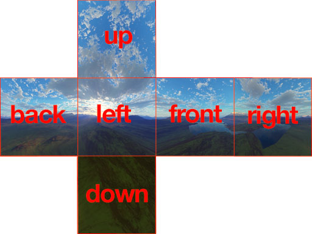

✔ Thing to do.

- [ ] C#
- [ ] Git
- [ ] Python(Algorithm)

✔ Recaps

- [ ] 몬스터 동적 생성(랜덤한 위치에)
- [ ] 싱글턴
- [ ] 풀링

<hr>

<h2>2021-04-05 ~ </h2>

<h3>Terms</h3>

> <ul>
>    <li>Mesh : 3D 모델</li>
>    <li>Material : 메쉬에 적용할 텍스쳐의 속성 정보</li>
>    <li>Texture : 모델의 표면에 그려지는 이미지 파일</li>
>    <b>Texture -> Material -> Mesh</b>
>    <li>Triangle : Mesh를 구성하는 면 요소(삼각형)</li>
>    <li>Vertex : Triangle의 각 꼭짓점</li>
> </ul>
> <h4>Scene, Game Object</h4>
> <ul>
> <li>Scene : 월드맵, 엔딩 등</li>
> <li> Game Object : Scene을 구성하는 모든 객체</li>
> </ul>
> <h4>Prefab</h4>
> - 객체지향 같은 개념. 클래스를 만든 후, 인스턴스로 복제해 사용한다.
>
> <h4>Component Based Developement</h4>
> - 오브젝트에 필요한 <b><i>'컴포넌트'</i></b>를 추가, 제거하는 방식으로 개발

<h3>Short Cuts</h3>

> <ul>
> <li><b>Q,W,E,R,T, Y : Tools</b><br></li>
> <li><b>Ctrl + Shift + C : Console view</b><br></li>
> <li><b>Ctrl + D : Duplicate</b><br></li>
> <li><b>Ctrl + P : Play / Stop</b><br></li>
> <li><b>Ctrl + Shift + P : Pause</b><br></li>
> <li><b>Ctrl + Alt / Alt : View 조정 가능</b><br></li>
> <li><b>Shift + F : 특정 오브젝트 포커싱</b></li>
> <li><b>Ctrl + Shift + A : Add Component</b></li>
> </ul>

<h3>Essential Tips</h3>
 
 > <b> Pivot, Local, Hierarchy-Sorting</b><br>
 > <b> 1 grid = 1 unit (X,Y,Z축 1단위)</b><br>
 > <b>Capsule모델 : 일반적인 사람 사이즈</b>


<h3>Materials</h3>

> <b>Materials</b> 폴더 : 예약명(<b>Materials</b>), 폴더를 만들고 Material 객체에 텍스쳐 할당<br>
> 텍스쳐(<b>Image</b>)를 <b>Scene</b>에 직접 넣으면 <b>Materials</b>폴더가 있는지 검사해서 자동으로 material 생성<br>
> shader -> mobile >> particle >> additive(검정색을 투명으로)<br>
> Albedo - 텍스쳐 정보, Normal Map - 간단한 쉐이딩<br>
> Material 오브젝트 안에 옵션이 있음.

<h3>Input</h3>

> 입력장치의 이벤트를 받아옴, Input Manager에서 설정가능.
> 스크립트에서 Input 클래스로 받아올 수 있다.

<i>code</i>

```
// 이름이 정해져있음.
float h = Input.GetAxis("Horizontal);
float v = Input.GetAxis("Vertical);

//앞뒤, 좌우
Vector3 moveDir = Vector3.forward * v + Vector3.right *  h;

// Space.Self : 객체를 기준으로 이동(기본 값)
transform.Translate(moveDir.nomalized * 0.1f, Space.Self);

//Vector3.forward == new Vector3(0,0,1)
//Vector3.up      == new Vector3(0,1,0)
//Vector3.right   == new Vector3(1,0,0)
//Vector3.one  == new Vector3(1,1,1)
//Vector3.zero == new Vector3(0,0,0)
```

<h3>Physics</h3>

> <ul>
> <li>Mass : 무게</li>
> <li>Drag : 마찰력</li>
> <li>is Kinematic : 스크립트를 이용해 움직임을 적용(물리엔진 작용x)</li>
> <li>interpolate : 물리엔진의 계산값, 렌더링 프레임의 차이에 따른 jiterring 발생, 보정해주는 옵션</li>
> <li>Collision : 속도가 너무 빠른 물체 - Discrete로 감지 못할수도 있음. 밑에 옵션은 잘 감지하는 대신 부하가 커짐.</li>
> </ul>
> <h4>Collision</h4>
> sphere - capsule - box 순으로 빠름<br>
> 충돌 콜백 발생 조건 : 두 물체에 모두 collider 존재, 움직이는 물체 -> RigidBody 컴포넌트<br>
> <h4> Quaternion </h4>
> (x, y, z, w) -> 4차원 벡터, 3차원상 회전에서 발생할 수 있는 짐벌락을 방지할 수 있는 기능<br>
> 내부적으로 Degree --> Quaternion 자동 변환<br>
> LookLotation : 벡터를 쿼터니온으로<br>
> Euler : 각도를 쿼터니온으로<br>

<h3>Coroutine</h3>

> - <b><u>단일 쓰레드를 멀티 쓰레드처럼 사용</u></b><br>
>   메인 루틴<br>
>   서브루틴(1/10)<br> > <b>Yield!</b><br>
>   메인 루틴<br>
>   서브루틴(2/10)<br> > <b>Yield!</b><br> > <b>...</b><br>
>   ex)게임 중 다운로드....<br>

<i>code</i>

```
StartCoroutine(ShowMuzzleFlash());
IEnumerator ShowMuzzleFlash()
{
    logic 1
    yield CONDITION 조건만족할때까지 메인루틴 진행
    logic 2 <-- 여기로 바로 들어온다.
}
```

### SkyBox

 <ol>
    <li><b>SkyBox Model: </b> 6면체에 각각의 View를 구현 <br>6장의 영상 >> 부하가 크다.</li>
    <li><b>SkyBox Dome: </b> 한장의 이미지를 돔형태로 둘러싸는 형태, 왜곡 발생 가능성</li>
    <li><b>Procedural Sky: </b> 색만 사용해서 하늘을 표현, 유니티 디폴트</li>
 </ol>

<h3>Animation Type</h3>

> <ul>
>     <li> <b>Legacy</b> (가벼운 모델, 코드로 지정함)</li>
>     <li> <b>Mecanim</b>
>         <ul>
>         <li> <b>Hummanoid</b> : 사람</li>
>         <li> <b>Generic</b> : 동물 등등</li>
>         (동적 애니메이션 구성 가능)
>         </ul>
>     </li>
>     <br>
>     <li> <b>Animation</b> Componet : Legacy</li>
>     <li> <b>Animator</b> Componet : Mecanim</li>
> </ul>

<h3>Animation(Legacy)</h3>
<i>code</i>

```
private float lb;
public Animation anim;
anim = GetComponent<Animation>();

//Project Setting -> Input Manager(이름 및 입력받을 키 지정)
lb = Input.GetAxis("Fire1");
if(lb >0)
{
    //IdleFireSMG라는 애니메이션 동작, CrossFade -> 자연스러운 전환
    anim.CrossFade("IdleFireSMG");
}
```




> <b>Window -> Rendering -> Lightning -> Envioronment -> Sky Box Materials<br>

<h3>Animator(Generic, Humanoid)</h3>

> 아바타 + 모션 적용(Join를 기반으로 유니티 내부에서 애니메이션을 적응)<br>
> 오브젝트에 컨트롤러를 적용하고 컨트롤러에 모션 등록<br>
> Finite State Machine(유한상태머신, FSM)의 형태로 구현<br>
>
> Has Exit Time : 현재 애니매이션 끝나야 넘어감


### 네비게이션

> Route Finding 알고리즘<br>
> 지형지물에 static 옵션 중 Nav를 적용하고, 움직이려는 오브젝트에 agent속성 부여<br>
> agent가 지형지물 피해서 최적의 경로로 움직인다.<br>

<i>code</i>

```
using UnityEngine.AI; //네비게이션 관련 패키지
...
private NavMeshAgent agent;
agent = GetComponent<NavMeshAgent>();
agent.SetDestination(playerTr.position); //에이전트를 움직임
agent.isStopped = true; //움직임 멈춤?
```

isKinematic : 물리엔진 계산 ㄴㄴ -> UseGravity도 같이 비활성화됨.
isTrigger : 물리적 반동효과 ㄴㄴ

```
public delegate void delgater(); -> 델리게이트를 관리하는 delgater 타입
public delgater OnPlayerDie -> (함수를 저장하는) 변수
OnPlayerDie += this.YouWin;
OnPlayerDie();
```

### 모델 간소화하기
> 모델의 각 부분 : gameObject로 구성, 각각 transform 컴포넌트가 존재 -> 물리엔진 불필요한 계산<br>
> Model -> Rig -> Optimize Game Object에서 불필요한 오브젝트 hide.<br>

### Layer 
> 오브젝트에 2개 이상의 collider가 존재할 경우, 오브젝트 내부 collider간 충돌 발생<br>
> 레이어를 추가해 collider에 레이어를 분리.
> Project Settings -> Physics -> Layer Collision Matrix 수정